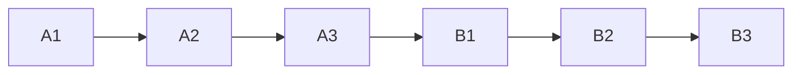
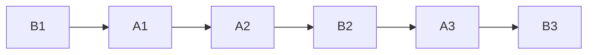

## 并发编程模型的两个关键问题

- 线程间如何通信？即：线程之间以何种机制来交换信息
- 线程间如何同步？即：线程以何种机制来控制不同线程间操作发生的相对顺序

有两种并发模型可以解决这两个问题：

- 消息传递并发模型
- 共享内存并发模型

|                  | 如何通信                                                     | 如何同步                                                     |
| ---------------- | ------------------------------------------------------------ | ------------------------------------------------------------ |
| 消息传递并发模型 | 线程之间没有公共状态，线程间的通信必须通过发送消息来显示进行通信 | 发送消息天然同步，因为发送消息总是在接收消息之前，因此同步是隐式的 |
| 共享内存并发模型 | 线程之间共享程序的公共状态，通过写-读内存中的公共状态进行隐式通信 | 必须显式指定某段代码需要在线程之间互斥执行，同步是显式的     |

在Java中，使用的是共享内存并发模型。

## Java内存模型的抽象结构

### 运行时内存的划分

对于每一个线程来说，栈都是私有的，而堆是共有的。

也就是说在栈中的变量

而在堆中的变量是共享的，本文称为共享变量。

所以内存可见性是针对的共享变量。

### 既然堆是共享的，为什么在堆中会有内存不可见问题？

这是因为现代计算机为了高效，往往会在高速缓存区中缓存共享变量，因为cpu访问缓存区比访问内存要快得多。

Java线程之间的通信由Java内存模型（JMM）控制，从抽象的角度来说，JMM定义了线程和主内存之间的抽象关系。如图：


从图中可以看出：

1. 所有的共享变量都存在主内存中
2. 每个线程都保存了一份该线程使用到的共享变量的副本
3. 如果线程A与线程B之间要通信的话，必须经历下面两个步骤：
   - 线程A将本地内存A中更新过的共享变量刷新到主内存中
   - 线程B到主内存中去读取线程A之前已经更新过的共享变量

**所以，线程A无法直接访问线程B的工作内存，线程间通信必须经过主内存**

根据JMM的规定，**线程对共享变量的所有操作都必须在自己的本地内存中进行，不能直接从主内存中读取**

那么，怎么知道这个共享变量被其他线程更新了呢？这就是JMM的功劳了，也是JMM存在的必要性之一。**JMM通过控制主内存与每个线程的本地内存之间的交互，来提供内存可见性保证**

> Java中的volatile关键字可以保证多线程操作共享变量的可见性以及禁止指令重排序，synchronized关键字不仅保证可见性，同时也保证了原子性（互斥性）。在更底层，JMM通过内存屏障来实现内存的可见性以及禁止重排序。

###  JMM与Java内存区域划分的区别和联系

- 区别

  两者是不同的概念层次。JMM是抽象的，他是用来描述一组规则，通过这个规则来控制各个变量的访问方式，围绕原子性、有序性、可见性等展开的。而Java运行时内存的划分是具体的，是JVM运行Java程序时，必要的内存划分。

- 联系

  都存在私有数据区域和共享数据区域。一般来说，JMM中的主内存属于共享数据区域，他是包含了堆和方法区；同样，JMM中的本地内存属于私有数据区域，包含了程序计数器、本地方法栈、虚拟机栈。

---


## 什么是重排序?

计算机在执行程序时，为了提高性能，编译器和处理器常常会对指令做重排。

**为什么指令重排序可以提高性能？**

```java
a = b + c;
d = e - f;
```

先加载b或c（**注意，即有可能先加载b，也有可能先加载c**），但是在执行add(b,c)的时候，需要等待b、c装载结束后才能继续执行，。。。。

**指令重排对于提高CPU处理性能十分必要，虽然由此带来了乱序的问题，但是这点牺牲是值得的**

指令重排一般分为以下三种：

- **编译器优化重排**

  编译器在**不改变单线程程序语义**的前提下，可以重新安排语句的执行顺序

- **指令并行重排**

  现代处理器采用了指令级并行技术来将多条指令重叠执行。如果**不存在数据依赖性**（即后一个执行的语句无需依赖前面执行的语句的结果），处理器可以改变语句对应的机器指令的执行顺序

- **内存系统重排**

  由于处理器使用缓存和读写缓存冲区，这使得load和store操作看上去可能是在乱序执行，因为三级缓存的存在，导致内存与缓存的数据同步存在时间差。

指令重排可以保证串行语义一致，但是没有义务保证多线程间的语义也一致。所以在多线程下，指令重排序可能会导致一些问题。


## 顺序一致性模型与JMM的保证


顺序一致性模型是一个**理论参考模型**， 内存模型在设计的时候都会以顺序一致性内存模型作为参考

### 数据竞争与顺序一致性

当程序未正确同步的时候，就有可能存在数据竞争

> 数据竞争，在一个线程中写一个变量，在另一个线程中读同一个变量，并且写和读没有通过同步来排序

如果程序中包含了数据竞争，那么运行的结果往往充满了不确定性。

Java内存模型（JMM）对于正确同步多线程程序的内存一致性做了以下保证

> 如果程序是正确同步的，程序的执行将具有顺序一致性。即程序的执行结果和该程序在顺序一致性模型中执行的结果相同。

这里的同步包括了使用 volatile、final、synchronized 等关键字来实现多线程下的同步

### 顺序一致性模型

是一个理想化的理论参考模型，为程序员提供了极强的内存可见性保证。

顺序一致性模型有两大特性：

- 一个线程中的所有操作必须按照程序的顺序（即Java代码的顺序）来执行
- 不管程序是否同步，所有线程都只能看到一个单一的操作执行顺序。即在顺序一致性模型中，每个操作必须是原子性的，且立刻对所有线程可见。

举个例子：

假设有两个线程A和B并发执行，线程A有3个操作，他们在程序中的顺序是

假设**正确使用了同步**，A线程的3个操作执行后释放锁，B线程获取同一个锁。那么在顺序一致性模型中的执行效果如下：



假设**没有使用同步**，那么顺序一致性模型中的执行效果如下：



操作的执行整体上无序，但是两个线程都只能看到这个执行顺序。之所以可以得到这个保证，是因为顺序一致性模型中的**每个操作必须立即对任意线程可见**

**但是JMM没有这样的保证**

---

### JMM中同步程序的顺序一致性效果

在顺序一致性模型中，所有操作完全按照程序的顺序串行执行。但是JMM中，临界区内（同步块或同步方法中）的代码可以发生重排序（但不允许临界区内的代码“逃逸”到临界区之外，因为会破坏锁的内存语义）

虽然线程A在临界区做了重排序，但是因为锁的特性，线程B无法观察到线程A在临界区的重排序。这种重排序既提高了执行效率，又没有改变程序的执行结果。

同时，JMM会在退出临界区和进入临界区做特殊的处理，使得在临界区内程序获得与顺序一致性模型相同的内存视图。

**由此可见，JMM的具体实现方针是：在不改变（正确同步的）程序执行结果的前提下，尽量为编译期和处理器的优化行方便**

### JMM中未同步程序的顺序一致性效果

对于未同步的多线程程序，JMM只提供**最小安全性**：线程读取到的值，要么是之前某个线程写入的值，要么是默认值，不会无中生有。

为了实现这个安全性，JVM在堆上分配对象时，首先会对内存空间清零，然后才会在上面分配对象

**JMM没有保证未同步程序的执行结果与该程序在顺序一致性中执行结果一致。**

**因为，如果要保证执行结果一致，那么JMM需要禁止大量的优化，对程序的执行性能会产生很大的影响**。

未同步程序在JMM和顺序一致性内存模型中的执行特性有如下差异：

- 顺序一致性保证单线程内的操作会按程序的顺序执行；JMM不保证单线程内的操作会按程序的顺序执行。（因为重排序，但是JMM保证单线程下的重排序不影响执行结果）

  > **再强调一下**：**顺序一致性的含义是一个理论参考模型，内存模型的设计都会以它作为参考**

- 顺序一致性模型保证所有线程只能看到一致的操作执行顺序，而JMM不保证所有线程都能看到一致的操作执行顺序。（因为JMM不保证所有操作立即可见）

- 顺序一致性模型保证对所有的内存读写操作都具有原子性，而JMM不保证对64位的long型和double型变量的**写操作**具有原子性


---

## Happens-before

### 什么是happens-before

一方面，我们需要JMM提供一个强的内存模型；另一方面，编译器和处理器希望JMM对它们的束缚越少越好，这样它们就可以最可能多的做优化来提高性能，希望的是一个弱的内存模型。

JMM考虑了这两种需求，并且找到了平衡点，对编译器和处理器来说，**只要不改变程序的执行结果（单线程程序和正确同步了的多线程程序），编译器和处理器怎么优化都行**。

JMM提供了happens-before规则（JSR-133规范），**提供了足够强的内存可见性保证**。

换言之，只要我们遵循happens-before规则，那么写的程序就能保证在JMM中具有强的内存可见性。

JMM使用happens-before的概念来定制两个操作之间的执行顺序。这两个操作可以在一个线程以内，也可以是不同的线程之间。

happens-before关系的定义如下：

- 如果一个操作happens-before另一个操作，那么第一个操作的执行结果将对第二个操作可见，而且第一个操作的执行顺序排在第二个操作之前。
- 两个操作之间存在happens-before关系，并不意味着java平台的具体实现必须要按照happens-before关系指定的顺序来执行。如果重排序之后的执行结果，与按happens-before关系来执行的结果一致，那么JMM也允许这样的重排序。

happens-before关系本质上和**as-if-serial**语义一样

**as-if-serial**语义保证单线程内重排序后的执行结果和程序代码本身应有的结果是一致的，happens-before关系保证正确同步的多线程程序的执行结果不被重排序改变。

总之，**如果操作A happens-before 操作B，那么操作A在内存上所做的操作对操作B都是可见的，不管它们在不在一个线程**。

### 天然的happens-before关系

在Java中，有以下天然的happens-before关系：

- 程序顺序规则
- 监视器锁规则
- volatile变量规则
- 传递性
- start规则：如果线程A执行操作ThreadB.start()启动线程B，那么A线程的ThreadB.start()操作happens-before于线程B中的任意操作
- join规则：

```java
int a = 1; // A
int b = 2; // B
int sum = a + b; // C

// 根据上述规则，假如只有一个线程，那么：
1. A happens-before B
2. B happens-before C
3. A happens-before C
```

真正在执行指令的时候，JVM有可能对A和B进行重排序，因为无论先执行A还是B，他们都对对方是可见的，并且不影响执行结果。

## Volatile

### 内存可见性

JMM有一个主内存，每个线程有自己私有的工作内存，工作内存中保存了一些变量在主内存中的拷贝。

**内存可见性，指的是线程之间的可见性，当一个线程修改了共享变量时，另一个线程可以读取到这个修改后的值**

在Java中，volatile关键字有特殊的内存语义。

volatile主要有以下两个功能

- 保证变量的内存可见性
- 禁止volatile变量与普通变量重排序

```java
public class VolatileExample {
    int a = 0;
    volatile boolean flag = false;
    
    public void writer() {
        a = 1;
        flag = true;
    }
    
    public void reader() {
        if (flag) sout(a)
    }
   t
}
```

### 禁止重排序

在JSR-133之前的旧的Java内存模型中，是允许volatile变量与普通变量重排序的。那上面的案例中，可能就会被重排序成下列时序来执行：

1. 线程A写volatile变量，step2，设置flag为true；
2. 线程B读同一个volatile，step3，读取到flag为true；
3. 线程B读普通变量，step4，读取到a=0；
4. 线程A修改普通变量，step1，设置a=1；

可见，如果volatile变量与普通变量发生了重排序，虽然volatile变量能保证内存可见性，也可能导致普通变量读取错误。

所以在旧的内存模型中，volatile的写-读就不能与锁的释放-获取具有相同的内存语义了。为了提供一种比锁更轻量级的线程间的通信机制，JSR-133专家组决定增强volatile的内存语义；严格限制编译器和处理器对volatile变量与普通变量的重排序。

JVM是怎么还能限制处理器的重排序的呢? 

通过**内存屏障**

什么是内存屏障？

硬件层面，内存屏障分两种：读屏障（Load Barrier) 和写屏障（Store Barrier）内存屏障有两个作用：

1. 阻止屏障两侧的指令重排序
2. 强制把写缓冲区/高速缓存中的脏数据等写回主内存，或者让缓存中相应的数据失效。

> 注意这里的缓存主要指的是CPU缓存，如L1, L2等

编译器在**生成字节码**时，会在指令序列中插入内存屏障来禁止特定类型的处理器重排序。编译器选择了一个**比较保守的JMM内存屏障插入策略**，这样可以保证在任何处理器平台，任何程序中都能得到正确的volatile内存语义。这个策略是：

- 在每个volatile写操作前插入一个StoreStore屏障
- 在每个volatile写操作后插入一个StoreLoad屏障
- 在每个volatile读操作后插入一个LoadLoad屏障
- 在每个volatile读操作后再插入一个LoadStore屏障


> 再逐个解释这几个屏障。注：Load代表读操作，Store代表写操作
>
> **LoadLoad屏障:** 对于这样的语句Load1；LoadLoad；Load2，在Load2及后续读取操作要读取的数据被访问前，保证Load1要读取的数据被读取完毕。
>
> **StoreStore屏障：** 对于这样的语句 Store1; StoreStore; Store2, 在Store2及后续写入操作执行前，这个屏障会把Store1强制刷新到内存，保证Store1的写入操作对其他处理器可见。
>
> **LoadStore屏障：** 对于这样的语句Load1；LoadStore；Store2，在Store2及后续写入操作被刷出前，保证Load1要读取的数据被读取完毕。
>
> **StoreLoad屏障：** 对于这样的语句 Store1; StoreLoad; Load2, 在Load2及后续所有读取操作执行前，保证Store1的写入对所有处理器可见。它的开销是四种屏障中最大的（冲刷写缓冲器，清空无效化队列）。在大多数处理器的实现中，这个屏障是万能屏障，兼具其他三种内存屏障的功能。

对于连续多个volatile变量读或者连续多个volatile变量写，编译器做了一定的优化来提高性能，比如：

> 第一个volatile读；
>
> LoadLoad屏障；
>
> 第二个volatile读；
>
> LoadStore屏障；

再介绍一下volatile与普通变量的重排序规则：

1. 如果第一个操作是volatile读，那么无论第二个操作是什么，都不能重排序
2. 如果第二个操作是volatile写，那么无论第一个操作是什么，都不能重排序
3. 如果第一个操作是volatile写，第二个操作是volatile读，那不能重排序。

如果是下列情况：第一个操作是普通变量读，第二个操作是volatile变量读，那么是可以重排序的。

### volatile的用途

从volatile的内存语义上来看，volatile可以保证内存可见性且禁止重排序。

在保证内存可见性这一点上，volatile有着与锁相同的内存语义，所以可以作为一个轻量级的锁来使用。但由于volatile仅仅保证对单个volatile变量的读/写具有原子性，而锁可以保证整个**临界区代码**的执行具有原子性。

所以**在功能上，锁比volatile更强大；在性能上，volatile更有优势**

```java
public class Singleton {
    private static Singleton instance; // 不使用volatile关键字
    
    public static Singleton getInstance() {
        if (instance == null) { // 第7行
			synchronized (Singleton.class) {
                if (instance == null) {
					instance = new Singleton(); // 第10行
                }
            }
        }
        return instance;
    }
}
```

如果这里的变量声明不使用volatile关键字，是可能发生错误的，它可能会被重排序：

```java
instance = new Singleton();

// 可以分解为以下三个步骤
1 memory=allocate(); // 分配内存， 相当于c的malloc
2 ctorInstanc(memory) //初始化对象
3 s=memory //设置s指向刚分配的地址

// 上述三个步骤可能会被重排序为 1-3-2，也就是：
1 memory=allocate();// 分配内存 相当于c的malloc
3 s=memory //设置s指向刚分配的地址
2 ctorInstanc(memory) //初始化对象
```

一旦假设发生了这样的重排序，比如线程A在第10行执行了步骤1和步骤3，但是步骤2还没有执行完。这个时候另一个线程B执行到了第7行，它会判定instance不为空，然后直接返回了一个未初始化完成的instance！

### Synchronized关键字

首先需要明确的一点是：**Java多线程的锁都是基于对象的**，Java中的每一个对象都可以作为一个锁。

**类锁**也是对象锁、

Java类只有一个Class对象（可以有多个实例对象，多个实例对象共享这个Class对象），而Class对象也是特殊的Java对象。所以我们常说的类锁，就是Class对象的锁

synchronized翻译成中文是“同步”的意思

我们通常使用 synchronized 关键字来给一段代码或一个方法上锁。它通常有以下三种形式：

```java
// 关键字在实例方法上，锁为当前实例
public synchronized void instanceLock() {
    
}

// 关键字在静态方法上，锁为当前Class对象
public static synchronized void classLock() {
    
}

// 关键字在代码块上，锁为括号里面的对象
public void blockLock() {
    Object o = new Objec();
    synchronied (o) {
        
    }
}
```

我们这里介绍一下“临界区”的概念。所谓“临界区”，指的是某一块代码区域，它同一时刻只能由一个线程执行。在上面的例子中，如果synchronized关键字在方法上，那临界区就是整个方法内部。而如果是使用synchronized代码块，那临界区就指的是代码块内部的区域。

下面这两个写法其实是等价的作用：

```java
// 关键字在实例方法上，锁为当前实例
public synchronized void instanceLock() {
    
}
// 关键字在代码块上，锁为括号里面的对象
public void blockLock() {
    synchronized (this) {
        
    }
}
```

同理，下面这两个方法也应该是等价的：

```java
// 关键字在静态方法上，锁为当前Class对象
public static synchronized void classLock() {
    
}

// 关键字在代码块上，锁为括号里面的对象
public void blockLock() {
    synchronized (this.getClass()) {
        
    }
}
```

## 几种锁

Java 6 为了减少获得锁和释放锁带来的性能消耗，引入了“偏向锁”和“轻量级锁”

在Java 6 之前，所有的锁都是“重量级”锁。在Java 6 及其以后，一个对象其实有四种状态，他们级别由低到高：

1. 无锁状态
2. 偏向锁状态
3. 轻量级锁状态
4. 重量级锁状态

无锁就是没有对资源进行锁定，任何线程都可以尝试去修改它

几种锁会随着竞争情况逐渐升级，锁的升级很容易发生，但是锁降级发生的条件会比较苛刻，锁降级发生在Stop The World期间，当JVM进入安全点的时候，会检查是否有闲置的锁，然后进行降级。

> 关于锁降级有两点说明：
>
> 1.HotSpot JVM是支持锁降级的
>
> 2.上面提到的Stop The World期间，以及安全点，是JVM的知识范畴

### Java对象头

Java的锁都是基于对象的。

一个对象的“锁”的信息是存放在什么地方的。

每个Java对象都有对象头。如果是非数组类型，则用**2个字宽**来存储对象头，如果是数组，则会用3个字宽来存储对象头。在32位处理器中，一个字宽是32位；在64位虚拟机中，一个字宽是64位。对象头的内容如下表

| 长度      | 内容                   | 说明                         |
| --------- | ---------------------- | ---------------------------- |
| 32/64 bit | Mark Word              | 存储对象的HashCode或锁信息等 |
| 32/64 bit | Class Metadata Address | 存储到对象类型数据的指针     |
| 32/64 bit | Array length           | 数组的长度（如果是数组）     |

主要看看Mark Word的格式：

| 锁状态   | 29 bit 或 61 bit                    | 1 bit 是否是偏向锁         | 2 bit 锁标志位 |
| -------- | ----------------------------------- | -------------------------- | -------------- |
| 无锁     |                                     | 0                          | 01             |
| 偏向锁   | 偏向的线程ID                        | 1                          | 01             |
| 轻量级锁 | 指向栈中（Lock Record）锁记录的指针 | 此时这一位不用于标识偏向锁 | 00             |
| 重量级锁 | 指向互斥量（堆中monitor对象）的指针 | 此时这一位不用于标识偏向锁 | 10             |
| GC标记   |                                     | 此时这一位不用于标识偏向锁 | 11             |

### 偏向锁

HotSpot的作者经过以往的研究发现大多数情况下，**锁不仅不存在多线程竞争，而且总是由同一线程多次获得**，于是引入了偏向锁。

偏向锁会偏向于第一个访问锁的线程，如果在接下来的运行过程中，该锁没有被其他的线程访问，则持有偏向锁的线程将永远不需要触发同步。

也就是说，**偏向锁在资源无竞争情况下消除了同步语句，连CAS操作都不做了，提高了程序的运行性能。**

> 大白话就是对锁置个变量，如果发现为true，代表资源无竞争，则无需再走各种加锁/解锁流程。如果为false，代表存在其他线程竞争资源，那么就会走后面的流程。

#### 实现原理

一个线程在第一次进入同步块时，会在对象头和栈帧中的锁记录里存储锁的偏向的线程ID。当下次该线程进入这个同步块时，会去检查锁里的Mark Word是不是放的自己的线程ID。

如果是，表明该线程已经获得了锁，以后该线程在进入和退出同步块时，不需要花费CAS操作来加锁和解锁；如果不是，就代表有另一个线程来竞争这个偏向锁。这个时候会尝试使用CAS来替换Mark Word里面的线程ID为新线程的ID，这个时候分两种情况：

- 成功，表示之前的线程不存在了，Mark Word里面的线程ID为新线程的ID，锁不会升级，仍然为偏向锁；
- 失败，表示之前的线程仍然存在，那么暂停之前的线程，设置偏向锁标识为0，并设置锁标识位为00，升级为轻量级锁，会按照轻量级锁的方式进行竞争锁。

> CAS： Compare and Swap
>
> 比较并设置。用于在硬件层面上提供原子性操作。在Intel处理器中，比较并交换通过指令cmpxchg实现。比较是否和给定的数值一致，如果一致则修改，不一致则不修改。

线程竞争偏向锁的过程如下：


### 撤销偏向锁

偏向锁使用了一种等到竞争出现才释放锁的机制，所以当其他线程尝试竞争偏向锁的时候，持有偏向锁的线程才会释放锁。

偏向锁升级成轻量级锁时，会暂停拥有偏向锁的线程，重置偏向锁标识，这个过程看起来容易，实则开销还是很大的，大概的过程如下：

1. 在一个安全点（在这个时间点上没有字节码正在执行）停止拥有锁的线程
2. 遍历线程栈，如果存在锁记录的话，需要修复锁记录和Mark Word，使其变成无锁状态。
3. 唤醒被停止的线程，将当前锁升级成轻量级锁。

所以，如果应用程序里所有的锁通常处于竞争状态，那么偏向锁就会是一种累赘，对于这种情况，我们可以一开始就把偏向锁置个默认功能给关闭：

```java
-XX：UseBiasedLocking=false
```


### 轻量级锁

多个线程在不同时段获取同一把锁，即不存在锁竞争的情况，也就没有线程阻塞。针对这种情况，JVM采用轻量级锁来避免线程的阻塞与唤醒。

#### 轻量级锁的加锁

JVM会为每个线程在当前线程的栈帧中创建用于存储锁记录的空间，我们成为Displaced Mark Word。如果一个线程获得锁的时候发现是轻量级锁，会把锁的Mark Word复制到自己的Displaced Mark Word里面。

然后线程尝试用CAS将锁的Mark Word替换为指向锁记录的指针。如果成功，当前线程获得锁，如果失败，表示Mark Word已经被替换成了其他线程的锁记录，说明在与其它线程竞争锁，当前线程就尝试用自旋来获取锁。

> 自旋：不断尝试去获取锁，一般用循环来实现。

自旋是需要消耗CPU的，如果一直获取不到锁的话，那该线程就一直处在自旋状态，白白浪费CPU资源。解决这个问题最简单的方法就是指定自旋的次数，例如让其循环10次，如果还没获取到锁就进入阻塞状态。

JDK采用了更聪明的方式——适应性自旋，简单来说就是线程如果自旋成功了，则下次自旋的次数会更多，如果自旋失败了，则自旋的次数就会减少。

自旋也不是一直进行下去的，如果自旋到一定程度（和JVM、操作系统相关），依然没有获取到锁，称为自旋失败，那么这个线程会阻塞。同时这个锁就会**升级成重量级锁**。

**轻量级锁的释放：**

在释放锁时，当前线程会使用CAS操作将Displaced Mark Word的内容复制回锁的Mark Word里面。如果没有发生竞争，那么这个复制的操作会成功。如果有其他线程因为自旋多次导致轻量级锁升级成了重量级锁，那么CAS操作会失败，此时会释放锁并唤醒被阻塞的线程。


### 重量级锁

重量级锁依赖于操作系统的互斥量（mutex）实现的，而操作系统中线程间的状态的转换需要相对比较长的时间，所以重量级锁的效率很低，但被阻塞的线程不会消耗CPU。

前面说到，每一个对象都可以当做一个锁，当多个线程同时请求某个对象锁时，对象锁会设置几种状态来区分请求的线程：

```java
Contention List: 所有请求锁的线程将首先放置到该竞争队列
Entry List: Contention List中那些有资格成为候选人的线程被移到Entry List
Wait Set：那些调用wait方法被阻塞的线程被放置到了Wait Set
OnDeck：任何时刻最多只能有一个线程正在竞争锁，该线程为OnDeck
Owner：获得锁的线程成为Owner
!Owner: 释放锁的线程
```

当一个线程尝试获得锁的时候，如果该锁已经被占用，则会将该线程封装成一个 ObjectWaiter 对象插入到Contention List的队列的队首，然后调用 park 函数挂起当前线程。

当线程释放锁的时候，会从Contention List或Entry List中挑选一个线程唤醒，被选中的线程叫做 Heir presumptive 即假定继承人，假定继承人被唤醒后会尝试获得锁，但

synchronized是非公平的，所以假定继承人不一定能获得锁。这是因为对于重量级锁，线程先自旋尝试获得锁，这样做的目的是为了减少执行操作系统同步操作带来的开销。如果自旋不成功再进入等待队列。这对那些已经在等待队列中的线程来说，稍微显得不公平，还有一个不公平的地方是自旋线程可能会抢占了Ready线程的锁。

如果线程获得锁后调用Object.wait方法，则会将线程加入到WaitSet中，当被Object.notify唤醒后，会将线程从WaitSet移动到Contention List或EntryList中去。需要注意的是，当调用一个锁对象的wait或notify方法时，如当前锁的状态是偏向锁或轻量级锁则会先膨胀成重量级锁。

### 总结锁的升级流程

1. 检查MarkWord里面是不是放的自己的Thread Id，如果是，表示当前线程是处于“偏向锁”
2. 如果MarkWord不是自己的ThreadId，锁升级，这时候，用CAS来执行切换，新的线程根据MarkWord里面现有的ThreadId，通知之前线程暂停，之前线程将MarkWord的内容置为空。
3. 两个线程都把锁对象的HashCode复制到自己新建的用于存储锁的记录空间，接着开始通过CAS操作，把锁对象的MarkWord的内容修改为自己新建的记录空间的地址的方式竞争MarkWord。
4. 第三步中成功执行CAS的获得资源，失败的则进入自旋。
5. 自旋的线程在自旋过程中，成功获得资源（即之前获得资源的线程执行完成并释放了共享资源），则整个状态依然处于轻量级锁的状态
6. 如果自旋失败，进入重量级锁的状态，这个时候，自旋的线程进行阻塞，等待之前线程执行完成并唤醒自己。

### 各种锁的优缺点对比

| 锁       | 优点                                                         | 缺点                                           | 适用场景                           |
| -------- | ------------------------------------------------------------ | ---------------------------------------------- | ---------------------------------- |
| 偏向锁   | 加锁和解锁不需要额外的消耗，和执行非同步方法比仅存在纳秒级的差距 | 如果线程间存在锁竞争，会带来额外的锁撤销的消耗 | 适用于只有一个线程访问同步块场景   |
| 轻量级锁 | 竞争的线程不会阻塞，提高了程序的响应速度                     | 如果始终得不到锁竞争的线程使用自旋会消耗CPU    | 追求响应时间，同步块执行速度非常快 |
| 重量级锁 | 线程竞争不使用自旋，不会消耗CPU                              | 线程阻塞，响应时间缓慢                         | 追求吞吐量，同步块执行时间较长     |


## CAS与原子操作

### 乐观锁与悲观锁

锁可以从不同的角度分类。其中，乐观锁和悲观锁是一种分类方式。

**悲观锁：**

悲观锁就是我们常说的锁。对于悲观锁来说，它总是认为每次访问共享资源时会发生冲突，所以必须对每次数据操作加上锁，以保证临界区的程序同一时间只能有一个线程在执行。

**乐观锁：**

乐观锁又称为“无锁”，顾名思义，它是乐观派。乐观锁总是假设对共享资源的访问没有冲突，线程可以不停地执行，无需加锁也无需等待。而一旦多个线程发生冲突，乐观锁通常是使用一种称为CAS的技术来保证线程执行的安全性。

由于无锁操作中没有锁的存在，因此不可能出现死锁的情况，也就是说乐观锁天生免疫死锁。

乐观锁多用于"读多写少"的环境，避免频繁加锁影响性能；而悲观锁多用于“写多读少”的环境，避免频繁失败和重试影响性能。

### CAS的概念

CAS的全称是：比较并交换（Compare And Swap）在CAS中，有这样三个值：

- V: 要更新的变量（var）
- E: 预期值（expected）
- N: 新值（new）

比较并交换的过程如下：

判断V是否等于E，如果等于，将V的值设置为N；

CAS是一种原子操作，它是一种系统原语，是一条CPU的原子指令，从CPU层面保证它的原子性。

**当多个线程同时使用CAS操作一个变量时，只有一个会胜出，并成功更新，其余均会失败，但失败的线程并不会被挂起，仅仅是被告知失败，并且允许再次尝试，当然也允许失败的线程放弃操作**

### Java实现CAS的原理 - UnSafe类

前面说到，CAS是一种原子操作。那么Java是怎样来使用CAS的？

在Java中，如果一个方法是native的，那Java就不负责具体实现它，而是交给底层的JVM使用c或者c++去实现。

在Java中，有一个Unsafe类，在 package sun.misc 中。它里面是一些native方法，其中就有几个关于CAS：

```java
public final native boolean compareAndSwapObject(Object var1, long var2, Object var4, Object var5);

public final native boolean compareAndSwapInt(Object var1, long var2, int var4, int var5);

public final native boolean compareAndSwapLong(Object var1, long var2, long var4, long var6);
```

Unsafe中对CAS的实现是C++写的，它的具体实现和操作系统、CPU都有关系

Linux的X86下主要是通过 cmpxchg1 这个指令在CPU级完成CAS操作的，但在多处理器情况下必须使用lock指令加锁来完成。当然不同的操作系统和处理器的实现会有所不同

Unsafe类里面还有其他方法用于不同的用途。比如支持线程挂起和恢复的park和unpark，LockSupport类底层就是调用了这两个方法。

```java
public native void unpark(Object var1);

public native void park(boolean var1, long var2);
```

### 原子操作-AtomicInteger类源码简析

```java
package java.util.concurrent.atomic;
```

在 JDK 11 中，有如下17个类


大概的用途：

- 原子更新基本类型
- 原子更新数组
- 原子更新引用
- 原子更新字段

这里我们以AtomicInteger类的getAndAdd(int delta)为例：

```java
public final int getAndAdd(int delta) {
    return unsafe.getAndAddInt(this, valueOffset, delta);
}

// setup to use Unsafe.compareAndSwapInt for updates
private static final Unsafe unsafe = Unsafe.getUnsafe();
```

所以其实AtomicInteger类的getAndAdd(int delta) 方法是调用Unsafe类的方法来实现的：

```java
public final int getAndAddInt(Object var1, long var2, int var4) {
    int var5;
    do {
        var5 = this.getIntVolatile(var1, var2);
    } while(!this.compareAndSwapInt(var1, var2, var5, var5 + var4));
    return var5;
}
```

首先，对象 var1 是 this， 也就是一个 `AtomicInteger` 对象。然后 var2是一个常量VALUE

```java
private static final long valueOffset; // var2


static {
    try {
        valueOffset = unsafe.objectFieldOffset
            (AtomicInteger.class.getDeclaredField("value"));
    } catch (Exception ex) { throw new Error(ex); }
}
```

从方法名字来看，是得到了一个对象字段偏移量。

> 用于获取某个字段相对Java对象的“起始地址”的偏移量。
>
> 

```java
public final int getAndAddInt(Object var1, long var2, int var4) {
    int var5;
    do {
        var5 = this.getIntVolatile(var1, var2);
    } while(!this.compareAndSwapInt(var1, var2, var5, var5 + var4));
    return var5;
}
```

这里使用的是**do-while循环**。这种循环不多见，它的目的是**保证循环体内的语句至少会被执行一遍**。这样才能保证return 的值`v`是我们期望的值。

### ABA问题

所谓ABA问题，就是一个值原来是A，变成了B，又变回了A。这个时候使用CAS是检查不出变化的，但实际上却被更新了两次。

ABA问题的解决思路是在变量前面追加上版本号或者时间戳，从JDK1.5开始，JDK的atomic包里提供了一个类 `AtomicStampedReference` 类来解决ABA问题

```java
public boolean compareAndSet(V   expectedReference,
                             V   newReference,
                             int expectedStamp,
                             int newStamp) {
    Pair<V> current = pair;
    return
        expectedReference == current.reference &&
        expectedStamp == current.stamp &&
        ((newReference == current.reference &&
          newStamp == current.stamp) ||
         casPair(current, Pair.of(newReference, newStamp)));
}
```

`compareAndSet`方法的作用是首先检查当前引用是否等于预期引用，并且检查当前标志是否等于预期标志，如果二者都相等，才使用CAS设置为新的值和标志

### 循环时间长开销大

CAS多与自旋结合。如果自旋CAS长时间不成功，会占用大量的CPU资源。

解决思路是让JVM支持处理器提供的pause指令。

pause指令能让自旋失败时cpu睡眠一小段时间再继续自旋，从而使得读操作的频率低很多，为解决内存顺序冲突而导致的CPU流水线重排的代价也会小很多。

### 只能保证一个共享变量的原子操作

## AQS

### AQS简介

AQS是`AbstractQueuedSynchroinzer`的简称，即`抽象队列同步器`，从字面上理解：

- 抽象：抽象类，只实现一些主要逻辑，有些方法由子类实现
- 队列：使用先进先出（FIFO）队列存储数据
- 同步：实现了同步的功能

AQS是一个用来构建锁和同步器的框架，使用AQS能简单高效地构造出应用广泛的同步器，比如`ReentrantLock` `Semaphore` `ReentrantReadWriteLock` `SynchronousQueue` `FutureTask`等等都是基于AQS的

我们也能利用AQS非常轻松地构造出符合我们自己需求的同步器，只要子类实现它的几个`protected`方法就可以了。

### AQS的数据结构

AQS内部使用了一个volatile的变量state来作为资源的标识。同时定义了几个获取和改版state的protected方法，子类可以覆盖这些方法来实现自己的逻辑：

```java
getState()
setState()
compareAndSetState()
```

这三种叫做均是原子操作，其中compareAndSetState()的实现依赖于Unsafe的compareAndSwapInt() 方法

而AQS类本身实现的是一些排队和阻塞的机制，比如具体线程等待队列的维护（如获取资源失败入队/唤醒出队等）它内部使用了一个先进先出的双端队列，并使用两个指针head和tail用于标识队列的头部和尾部。数据结构如图：


但它并不是直接储存线程，而是储存**拥有线程的Node节点**

### 资源共享模式

资源有两种共享模式，或者说两种同步方式：

- 独占模式（Exclusive）：资源是独占的，一次只能一个线程获取。如	`ReentrantLock`
- 共享模式（Share）：同时可以被多个线程获取，具体的资源个数可以通过参数指定，如Semaphore/CountDownLatch。

一般情况下，子类只需要根据需求实现其中一种模式，也有同时实现两种模式的同步类，如 `ReadWriteLock`

AQS中关于这两种资源共享模式的定义源码（均在内部类Node中）。

```java
static final Node{
    
    static final Node SHARED = new Node();
    
    static final Node EXCLUSIVE = null;
    
    static final int CANCELLED = 1;
    static final int SIGNAL = -1;
    static final int CONDITION = -2;
    static final int PROPAGATE = -3;
    
    volatile int waitStatus;
    volatile Node prev;
    volatile Node next;
    volatile Thread thread;
    Node nextWaiter;
    
    // 判断共享模式的方法
    final boolean isShared() {
        return nextWaiter == SHARED;
    }
    
    // Used by addWaiter
    Node(Thread thread, Node mode) {
		this.nextWaiter = mode;
        this.thread = thread;
    }
   
}

// AQS里面的addWaiter私有方法
private Node addWaiter(Node mode) {
    // 使用了Node这个构造函数
    Node node = new Node(Thread.currentThread(), mode);
    
    Node pred = tail;
    if (pred != null) {
        node.prev = pred;
        if (compareAndSetTail(pred, node)) {
            pred.next = node;
            return node;
        }
    }
    enq(node);
    return node;
}

```

> 通过Node我们可以实现两个队列，一是通过prev和next实现CLH队列(线程同步队列，双向队列)。二是nextWaiter实现Condition条件上的等待线程队列（单向队列）， 这个Condition主要用在ReentrantLock类中

### AQS的主要方法源码解析

AQS的设计是基于模板方法模式的，它有一些方法必须要子类去实现，主要有：

- isHeldExclusively() : 该线程是否正在独占资源。只有用到condition才需要去实现它。
- tryAcquire(int)：独占方式。尝试获取资源，成功则返回true，失败则返回false。
- tryRelease(int)：独占方式。尝试释放资源，成功则返回true，失败则返回false。
- tryAcquireShared(int)：共享方式。尝试获取资源。负数表示失败；0表示成功，但没有剩余可用资源；正数表示成功，且有剩余资源。
- tryReleaseShared(int)：共享方式。尝试释放资源，如果释放后允许唤醒后续等待结点返回true，否则返回false。


### 获取资源

获取资源的入口是acquire(int arg)方法。arg是要获取的资源的个数，在独占模式下始终为1.

```java
public final void acquire(int arg) {
    if (!tryAcquire(arg) && acquireQueued(addWaiter(Node.EXCLUSIVE), arg)) {
        selfInterrupt();
    }
}
```

首先调用tryAcuire(arg)尝试去获取资源。

如果获取资源失败，就通过addWaiter（Node.EXCLUSIVE)方法发这个线程插入等待队列中。其中传入的参数代表要插入的Node是独占式的。这个方法的具体实现：

```java
// AQS里面的addWaiter私有方法
private Node addWaiter(Node mode) {
    // 使用了Node这个构造函数
    Node node = new Node(Thread.currentThread(), mode);
    // 将Node插入队列中
    Node pred = tail;
    if (pred != null) {
        node.prev = pred;
        // 使用CAS尝试，如果成功就返回
        if (compareAndSetTail(pred, node)) {
            pred.next = node;
            return node;
        }
    }
    // 如果等待队列为空或者上述CAS失败，再自旋CAS插入
    enq(node);
    return node;
}

// 自旋CAS插入等待队列
private Node enq(final Node node) {
    for (;;) {
        Node t = tail;
        if (t == null) {
            if (compareAndSetHead(new Node())){
            	tail = head;
            }
        } else {
            node.prev = t;
            if (compareAndSetTail(t, ndoe)) {
                t.next = node;
                return t;
            }
        }
    }
}
```


