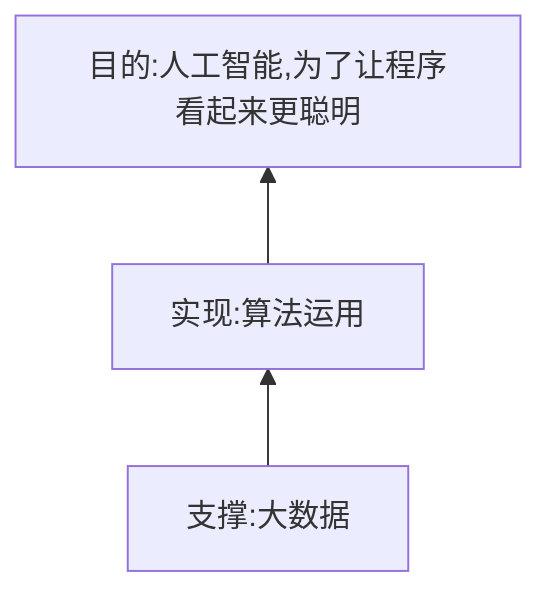

## 大数据

现实中很多问题，都可以转化为分类问题和回归问题，如何既“准”又“稳”的把事物分类

有了“云”架构，我们有了灵活手段的去调度硬件资源

这些概念火起来，是计算力的进步，是人类收集、存储、加工、处理、利用信息能力的进步

只能处理结构化数据，对大量非结构化数据（文字、语音、视频等），处理能力严重不足。

鉴于此，大数据处理系统来了。有了hadoop、spark、storm、hbase、 Elasticsearch、zookeeper等等大数据工具搭建起来的数据处理集群

更倾向于看**大数据**背后的技术对当前企业IT系统的革新

阿里巴巴已经把他们的大数据系统，改名为了"maxComputer"。从名字不难看出，大数据就是大电脑，这意味着更大的信息处理能力、更高的灵活性

### HDFS：Hadoop分布式文件系统

HDFS是Hadoop应用用到的一个最主要的分布式存储系统。一个HDFS集群主要由一个NameNode和很多个Datanode组成：Namenode管理文件系统的元数据，而Datanode存储了实际的数据。HDFS的体系结构在[这里](http://hadoop.apache.org/docs/r1.0.4/cn/hdfs_design.html)有详细的描述。本文档主要关注用户以及管理员怎样和HDFS进行交互。[HDFS架构设计](http://hadoop.apache.org/docs/r1.0.4/cn/hdfs_design.html)中的[图解](http://hadoop.apache.org/docs/r1.0.4/cn/images/hdfsarchitecture.gif)描述了Namenode、Datanode和客户端之间的基本的交互操作。基本上，客户端联系Namenode以获取文件的元数据或修饰属性，而真正的文件I/O操作是直接和Datanode进行交互的。

下面列出了一些多数用户都比较感兴趣的重要特性。

- Hadoop（包括HDFS）非常适合在商用硬件（commodity hardware）上做分布式存储和计算，因为它不仅具有容错性和可扩展性，而且非常易于扩展。[Map-Reduce](http://hadoop.apache.org/docs/r1.0.4/cn/mapred_tutorial.html)框架以其在大型分布式系统应用上的简单性和可用性而著称，这个框架已经被集成进Hadoop中。
- HDFS的可配置性极高，同时，它的默认配置能够满足很多的安装环境。多数情况下，这些参数只在非常大规模的集群环境下才需要调整。
- 用Java语言开发，支持所有的主流平台。
- 支持类Shell命令，可直接和HDFS进行交互。
- NameNode和DataNode有内置的Web服务器，方便用户检查集群的当前状态。
- 新特性和改进会定期加入HDFS的实现中。下面列出的是HDFS中常用特性的一部分：
  - 文件权限和授权。
  - 机架感知（Rack awareness）：在调度任务和分配存储空间时考虑节点的物理位置。
  - 安全模式：一种维护需要的管理模式。
  - fsck：一个诊断文件系统健康状况的工具，能够发现丢失的文件或数据块。
  - Rebalancer：当datanode之间数据不均衡时，平衡集群上的数据负载。
  - 升级和回滚：在软件更新后有异常发生的情形下，能够回滚到HDFS升级之前的状态。
  - Secondary Namenode：对文件系统名字空间执行周期性的检查点，将Namenode上HDFS改动日志文件的大小控制在某个特定的限度下。

## 区块链

